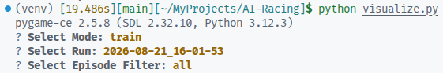

# AI Racing


*(If the MP4 doesn't autoplay on GitHub, you can use `<video src="assets/demo.mp4" autoplay loop muted />`)*

Reinforcement Learning agent that learns to drive a car around a track. Built with **Gymnasium**, **Pygame**, and **Stable Baselines3 (PPO)**.

## Features

- Custom kinematic physics and raycast sensors.
- Fully isolated artifact tracking for 100% reproducible training runs.
- Interactive terminal UI (TUI) for launching replays.
- YouTube-style timeline scrubber and playback speed controls.

## Architecture

- **Environment**: Custom 2D Gymnasium environment (`env/racing_env.py`). The car uses a kinematic physics model and raycast sensors to detect track boundaries.
- **Algorithm**: Proximal Policy Optimization (PPO).
- **Reward System**: Step penalty pushes speed. Checkpoint completion grants large rewards. Wall collisions terminate the episode with a penalty.
- **Artifacts**: Every training run generates an isolated folder containing its configuration, models, charts, and metrics for full reproducibility.

## Installation

Create a virtual environment and install dependencies:

```bash
python3 -m venv venv
source venv/bin/activate
pip install torch --index-url https://download.pytorch.org/whl/cpu
pip install -r requirements.txt
```

## Usage

### 1. Manual Testing

Drive the car manually using arrow keys (or W, A, S, D) to test physics and track boundaries.

```bash
python visualize.py --mode human
```

### 2. Configuration

Edit `config.yaml` to adjust hyperparameters before training:

- `learning_rate`: Step size for the optimizer.
- `total_timesteps`: Total frames the AI will experience during training.
- `eval_freq`: How often to evaluate and save the best model.
- `save_freq`: How often to save checkpoint models.

### 3. Training

Start the RL training loop.

```bash
python train.py
```

This creates `artifacts/<timestamp>/` containing:

- `config.yaml`: Backup of the settings used.
- `train/models/`: Saved model checkpoints (`.zip`).
- `train/logs/`: Tensorboard data and raw CSV metrics.
- `train/chart.png`: Static reward curve plotted at completion.

Monitor training live via Tensorboard:

```bash
tensorboard --logdir artifacts/<timestamp>/train/logs/
```

### 4. Evaluation

Run the best model to generate trajectory data for visualization.

```bash
python evaluate.py --run <timestamp>
# Example: python evaluate.py --run 2026-08-21_15-02-49
```

Saves `metrics.csv` and `trajectories.json` into `artifacts/<timestamp>/eval/`.

### 5. Visualization Hub (Interactive)


*(Placeholder: Take a screenshot of the terminal menu and save it as `assets/tui.png`)*

The easiest way to view the simulation is the interactive launcher. Just run:

```bash
python visualize.py
```

#### Replay Controls

- **Up / Down**: Speed up or slow down playback (+/- 30 FPS).
- **Left / Right**: Skip 50 frames backward or forward.
- **Mouse Click/Drag**: Scrub the timeline at the bottom of the window to instantly jump to any time.
- **R**: Export the entire replay as a `record_YYYY-MM-DD_HH-MM-SS.mp4` file in the project root.

You can also still use CLI arguments for automation:

```bash
python visualize.py --run <timestamp> --mode eval --episode best
```

- **Opaque Car**: The highlighted/best attempt.
- **Ghost Cars (Semi-transparent)**: Standard attempts.
- **Cyan Lines**: Active raycast sensors (what the AI sees).
