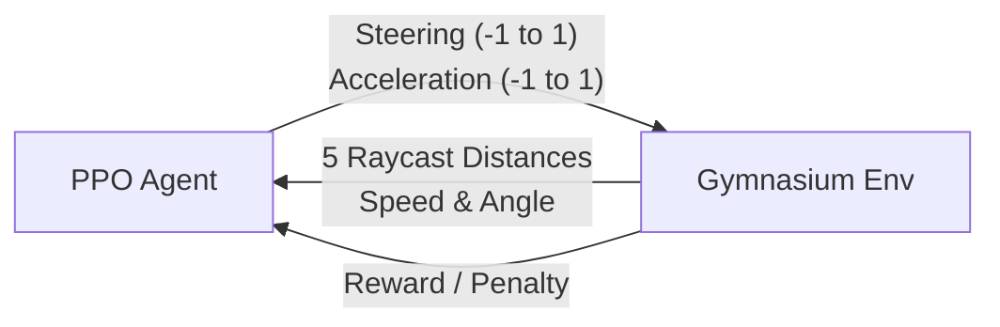

# AI Racing - Internal Architecture

This document breaks down the core mechanics of the AI Racing engine.

## 1. The Reinforcement Learning Loop

The system is built on Gymnasium and Stable Baselines3. The PPO agent interacts with the custom 2D environment at 60 frames per second.



## 2. The Reward Function

The AI is trained using a strict mathematical reward system that incentivizes speed and severely punishes mistakes.

- `-0.1` **Per Frame**: Applied constantly to punish the AI for driving too slowly.
- `+10.0` **Per Checkpoint**: Granted when the car crosses invisible gates placed along the track.
- `-50.0` **Wall Collision**: Massive penalty that instantly terminates the episode if the car touches the grass/walls.

## 3. Kinematic Physics & Sensors

- **Physics**: The car uses a 2D kinematic bicycle model. It calculates velocity, drift, and steering angle manually to simulate realistic tire friction.
- **Sensors**: The car projects 5 laser raycasts (spread in a cone in front of the car). These rays calculate the exact distance to the nearest track boundary, providing the AI with its "vision".

## 4. The Artifact System

To ensure 100% reproducibility, every single training run generates an isolated directory containing all its data.

```text
artifacts/
└── 2026-08-21_15-02-49/
    ├── config.yaml          # The hyperparameters used for this run
    ├── train/
    │   ├── models/          # Saved .zip checkpoints
    │   ├── logs/            # Tensorboard metrics
    │   └── chart.png        # Static reward curve generated at the end
    └── eval/
        ├── metrics.csv      # Evaluation scores
        └── trajectories.json# X/Y coordinate paths for the visualizer
```
